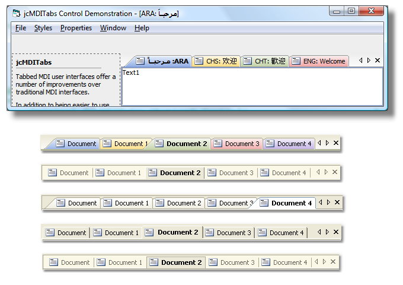



## jcMDITabs v1\.2

### Description

Sorry for the very LATE update. Nothing Special in the new version. Some Bug-Fixes and some new features. Close(x) button on each Tab is removed due to some problems. Office 2003 style added. A Dropdown Button added which opens a menu of all opened MDI-child documents as seen in VS 2005. jcMDITabs is a "no code" required solution for providing Tabbed MDI Interfaces in your applications. Just add the control to your MDI Main form, change some properties of Child Forms and you're ready to go! This control was originally developed by ANDREA BATINA in 2004. Any comments, suggestions are welcome. Please leave your votes if you like it ;-)

[April 13 2009]
 
### More Info
 

             |
---                |---
**Submitted On**   |2009-04-24 11:50:26
**By**             |[Juned Chhipa](https://github.com/Planet-Source-Code/PSCIndex/blob/master/ByAuthor/juned-chhipa.md)
**Level**          |Intermediate
**User Rating**    |4.9 (148 globes from 30 users)
**Compatibility**  |VB 6\.0
**Category**       |[OLE/ COM/ DCOM/ Active\-X](https://github.com/Planet-Source-Code/PSCIndex/blob/master/ByCategory/ole-com-dcom-active-x__1-29.md)
**World**          |[Visual Basic](https://github.com/Planet-Source-Code/PSCIndex/blob/master/ByWorld/visual-basic.md)
**Archive File**   |[jcMDITabs\_2151044302009\.zip](https://github.com/Planet-Source-Code/juned-chhipa-jcmditabs-v1-2__1-71752/archive/master.zip)

